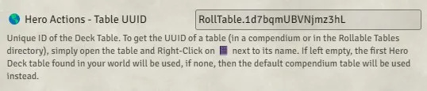
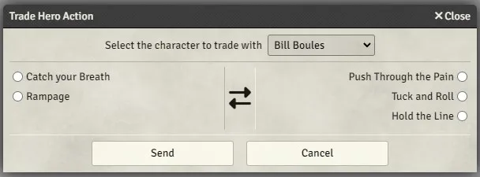
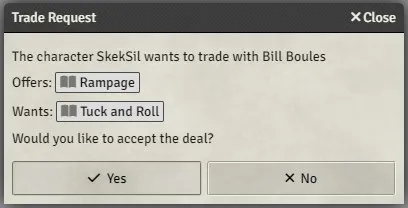
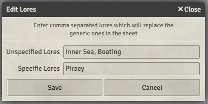
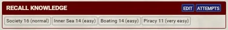
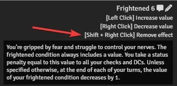
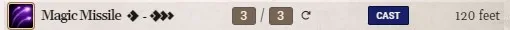
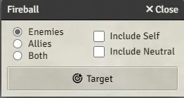
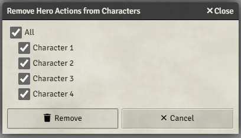
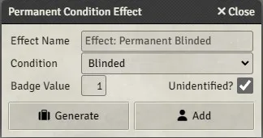

# FoundryVTT PF2e Toolbelt

A collection of utilities and features that are not big enough to warrant standalone modules.

When disabled, the features will have no impact on your world/client whatsoever.

# WORLD FEATURES

## Automatic Rune Progression (Requires Reload)

-   `Force Update` will always match the runes to the level of the actor, scaling them up and down if needed
-   `Keep Highest` will however only change the runes if the ones currently equipped are lower that what they should be

This feature is made to replace the `Automatic Bonus Progression` variant rule, instead it will automatically give the `potency`, `striking` and `resilient` runes on character's equipment when appropriate. Nothing else from the regular `Automatic Bonus Progression` will be replicated.

-   Weapons/Strikes with the `alchemical` & `bomb` traits will not receive any weapon potency/striking runes
-   Weapons/Strikes belonging to the `shield` group will not receive any weapon potency/striking runes (except `Shield Boss` and `Shield Spikes`)
-   Weapons/Strikes belonging to the `unarmed` category require an invested `Handwraps of Mighty Blows`

NOTE: The module will automatically disable the system `Automatic Bonus Progression` variant rule to function properly when this feature is enabled.

## Giveth

**IMPORTANT: A GM needs to be logged into your world to allow players to giveth their hard earned belongings.**

This module will allow players to give items to actors owned by the other players without any fuss, a simple drag & drop on a token and voila.

Players can also drag & drop effects/conditions that originated from them onto another actor that is owned by a player (the effect will lose its `unidentified` status and will have its `showIcon` set to `true` to avoid any possible weirdness), though this can sometimes result in some weirdness when effects rely on actor levels and such.

## Hero Actions

https://www.youtube.com/watch?v=8EezVnYQKyo

This feature integrates and automates the `Hero Deck` actions into the PF2e system.

It adds a new section in the `actions` tab of the character sheet where a player can **Draw**, **Discard** or **Use** `Hero Actions` in concert with the regular `Hero Points`.

-   If the character has more `Hero Points` than `Hero Actions`, the player will be asked to **Draw** new `Hero Actions` to fill in.

-   If the character has more `Hero Actions` than `Hero Points`, the player will be asked to **Discard** the excess of `Hero Actions`.

-   Otherwise the player will have the opportunity to **Use** any `Hero Actions` that are available to them, doing so will also spend one `Hero Point` from the character pool.

### Unique draw pool

By default, characters will draw randomly from a `hero Action` table without regard for which actions have already been drawn before.

If you want to have an unique action pool from which the actions are "removed" on draw until the pool is emptied (at which point, the pool will be refilled), you need to have a physical `Table` in your world.

Simply import the table from the compendium and uncheck the `Draw With Replacement?` option.

## Hero Actions - Table UUID

You can also have your own `Hero Actions` and table to draw them, to do so, you will need valid journal entries (in your world or in a compendium) and a table used to draw them.

Because the module cannot infer which table you are using in the case of a custom table, you will need to provide its UUID manually in the settings, to do so, open your table and `Right-Click` on the 📔 next to its name in the title bar, this will copy its UUID to your clipboard.

## Hero Actions - Allow Trade

Characters can trade `Hero Action` between each others.

If the initiating player is the owner of both characters (or is the GM), the trade will automatically be accepted.

The owner of the character traded with will receive a request popup and can accept or refuse the deal offered. If the player is not online, the GM will receive the request instead.

## Hero Actions - Private Draw

When enabled, the message generated when drawing hero actions will be private instead of public.

## Npc Lore Knowledges

This feature adds the ability to set custom lores for NPCs.

A new `Edit` button is added to the `Recall Knowledge` section of the NPC sheet which opens a new window where both the `Unspecified` and `Specific` lores can be set.

More than one of each can be set, simply by separating them with commas.

Once saved, the custom Lores will replace the generic ones on the sheet.

## Better Merchant (Requires Reload)

This will add extra settings to the default system merchant

### From Browser

Lets you add items directly from the compendium browser using a modified version of the `Equipment` browser tab, a limit of 100 items has been set.

### Buy Items

This makes the merchant able to buy items from players:

-   once the feature enabled, it will block the transfer if the trade is rejected for any reason
-   it uses filters processed from top to bottom, they are the same as the ones in the compendium browser
-   a filter is selected if it matches the item data and have enough gold remaining in its allocated purse (or have infinite gold)
-   once a filter is selected, its ratio will be used for the purchase
-   if no filter is selected, the ratio of the default filter will be used unless the `All Items` setting is disabled, in that case, the buy will be rejected
-   if the total gold purse cannot afford the buy, the trade will be rejected
-   if the selected filter purse cannot afford the buy and the `All Items` setting is disabled, the trade will be rejected
-   the gold purse of the selected filter will see its amount deducted by the calculated price (unless infinite)
-   the total gold purse is always used to check if an item can be purchased (unless infinite)
-   the total gold purse is always deducted by the calculated price (unless infinite)

### Price Ratio

Set a global selling ratio for all the goods, once an item leaves the merchant's inventory, its price will revert back to the regular value.

### Receive No Coins

When the merchant sells items, no coins will be added to its inventory in return.

### Infinite Stocks

The merchant will never run out of stocks, every item in its inventory (with the exception of treasures) will see its quantity set to 9999.

When this is disabled, `Infinite Stock` can be enabled on a per item bases, a new infinity icon will show up in the item row

## No Dropped Bulk (Requires Reload)

Dropped equipment in an actor's inventory won't be accounted for bulk value calculation

## Weightless Coins (Requires Reload)

Coins are weightless when enabled

## Share Health Pool

Allow 2 actors to share their HP and SP in a "master" and "slave" relationship. The option to select a "master" can be found in the `Configure` menu of a creature sheet.

-   a "master" cannot also have a "master"
-   a "master" can have multiple "slave"
-   a "slave" cannot also be a "master"

NOTE: The `Force Refresh` should only be used if you notice some modules getting out of sync with the "slave" creatures.

## Target Token Helper (Requires Reload)

Allow the use of Target Token Helper in your world, its different parts are client side settings and can be found below.

## Set Un-Identified Image

Automatically set the un-identifed image of items to be the same as the regular image:

-   `On Creation Only:` Should the un-identified image be set for newly created or imported items
-   `On Creation & Update:` Should the un-identified image also be set when the image of an item is updated

## Force Un-Target

Will forcibly remove the targets of all users at turn/round change. The 'Un-Target' client setting is overriden if this one is enabled.

# CLIENT FEATURES

## Remove Effect Shortcut

Using `[Shift + Right Click]` on effect icons in the effects panel will instantly remove all its charges/counters/badges

## Condition Sheet Icon

Adds the `Open Sheet` icon to conditions in the effects panel just like it would for non-condition effects

## Inventory

An experimental and unfinished alternate version of the character's inventory, allowing the organization and handling of equipped/invested/worned via drag & drop.

## Merge Damage

A new icon will appear in damage roll messages allowing the merging of the message with another one of the same type preceding it

-   the module will look at the 5 messages above it to find a matching message
-   the other message needs to have been initiated by the same `Actor`
-   the other message needs to have the same target (or both no target)

You can keep merging messages as long as the module find one appropriate

## Multi-Cast

A new `Multi` button will appear next to spells `Damage` button allowing the cast of multiple instances of the spell at once with only one chat message displayed

When this setting is enabled/disabled, the last 10 messages will be modified to add/remove the `Multi` button

## Stances

When enabled, new stances buttons will be added to you character sheets allowing an easy way to toggle them and more.

The module automatically "upgrade" you stances if need be (e.g. `Cobra Envenom` instead of `Cobra Stance`), will remove the stances at the end of the encounter

The Module automatically add/ask for a stance when a character with the `Stance Savant` feat joins an encounter

## Spells Summary

This feature offers the ability to toggle between the regular and an alternate version of the character sheet's `Spellcasting` tab at any moment.

To toggle between both modes, you simply need to click on the spellcasting nav button  at the top of the sheet.

The alternate version gather, sort and display all the available spells into a single table per level regardless of their category or casting type.

New informations are displayed to make up for the lack of category grouping: `DC`, `Check` and type `Innate`, `Prepared`, `Spontaneous` or `Focus`. The spellcasting entry name is also displayed when hovering over the `Check/DC` values.

When hovering over a spell, the resources used by the spell will also be dislayed and can be interacted with as shown in the image below.

_Resources of a spontaneous `Magic Missile` displayed on hover_

The alternate mode does not allow to create, edit or delete the spells, nor does it allow to change the spells selected from a spellbook. It is there to make it easier to see what is available during playtime.

This feature is fully compatible with the modules [PF2e Staves](https://foundryvtt.com/packages/pf2e-staves) and [PF2e Dailies](https://foundryvtt.com/packages/pf2e-dailies)

## Target Token Helper

<video controls src="readme/target/video.mp4" title="Title"></video>

Damage chat messages will have extra rows for each token that was targeted during the roll.
The ability to roll saves can directly be handled from there as well.

A GM can right click on a message with saves and select the `Roll All Saves` option to roll the save for all the NPCs that have yet to roll.

NOTE: The displayed tooltip for the saves respect all the system metagame settings.

You can drag & drop a save-check inline link from anywhere in foundry onto a damage chat message to add a `save` entry to it:

-   only links that have a DC and are of type reflex, will or fortitude will be draggable
-   the damage message musn't already have a `save` module entry
-   you must be the author of the damage message (or GM)

## Template Targetting

When placing a template on the board, a new dialog will show up allowing you to target all the tokens inside the template.

## Un-Target

Will remove all your targets at turn/round change. This is overridden by the 'Force Un-Target' world setting.

# Macros

A compendium pack containing macros has been added to the module for convenience

## Hero Actions - Create Table

You will be prompted with the option to create a `Default` or `Custom` table and if this table should or not use the `Unique Draw` feature.

When using that macro, the table will be created into your world with an obvious name and its UUID will also automatically be added to the settings.

## Hero Actions - Remove Hero Actions

You will be prompted with the list of the `Characters` from whom you want the actions to be removed.

## Permanent Condition Effect

Helps you generate (or directly add to an actor) an effect setting a permanent condition, you can select the condition, its badge value and if the effect is `unidentified` (making it impossible for the players to remove the condition)

The macro will automatically set the name of the effect (if none is provided) and its image

# API

the list of all the functions exposed in the global can be found in the [wiki](https://github.com/reonZ/pf2e-toolbelt/wiki#api)

# CHANGELOG

You can see the changelog [HERE](./CHANGELOG.md)
